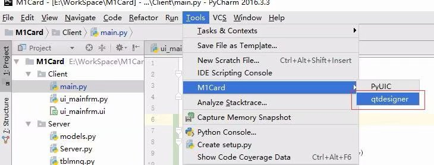
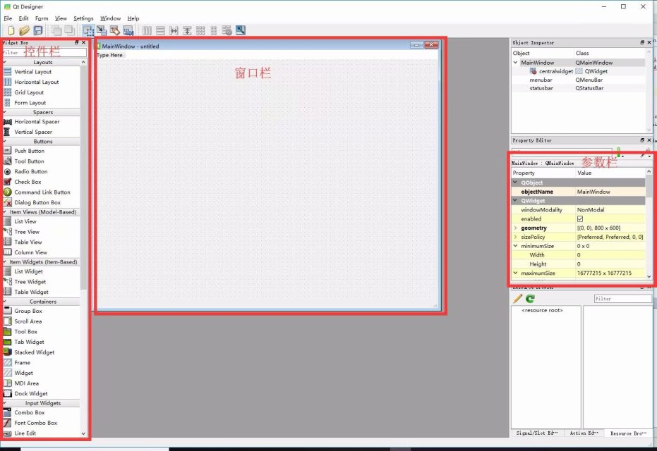
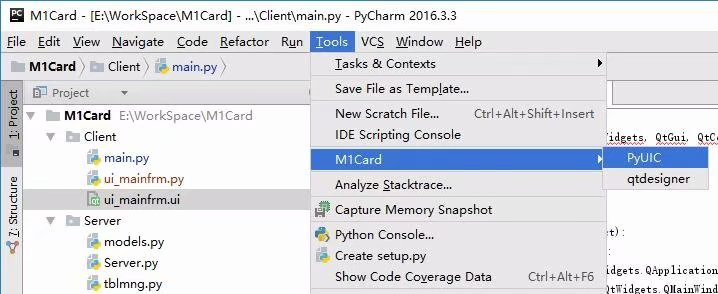
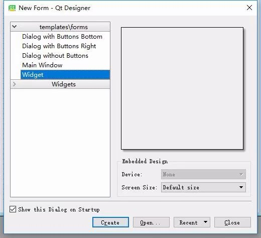

# PyQt5安装与配置
## 安装
> pip install PyQt5
> pip install pyqt5-tools
## 配置pycharm
Setting -> Tools -> Extrater Tools -> +
1. PYUIC
**Program**: *\python.exe
**Parameters**: -m PyQt5.uic.pyuic \$FileName\$ -o \$FileNameWithoutExtension\$.py 
2. qtdesigner
**Program**: *\Lib\site-packages\pyqt5-tools\designer.exe
## 使用qtdesigner
* pycharm打开qtdesigner  

通过该流程可以快速打开qtdesigner
* 手动打开qtdesigner 
*\Lib\site-packages\pyqt5-tools\designer.exe
* 使用qtdesigner

基本用法，所见即所得：
1.从控件栏拖动控件至窗口栏
2.在参数栏设置控件显示效果
3.绘制完成后将保存为.ui文件
* 使用pycharm根据.ui文件生成pyqt5的.py文件

选中.ui文件后，点击PYUIC即可生成对应的.py文件
* 手动生成.py文件  
命令行输入
>python -m PyQt5.uic.pyuic filename.ui -o filename.py  

* 生成图形界面  
新建main.py文件，添加下列代码后执行即可
```python
# coding= utf8
from PyQt5 import QtWidgets, QtGui, QtCore
from ui_mainfrm import Ui_MainWindow
import sys

if __name__ == "__main__":
    app = QtWidgets.QApplication(sys.argv)
    window = QtWidgets.QMainWindow() # ui使用的templates\forms是MainWindow
    # window = QtWidgets.QWidget() # ui使用的templates\forms是Widget
    # window = QtWidgets.QDialog() # ui使用的templates\forms是Dialog
    main = Ui_MainWindow()
    main.setupUi(window)
    window.show()
    sys.exit(app.exec_())
```
需要注意的是qtdesigner选择的templates\forms不同，则windows也是不同的


 
 

