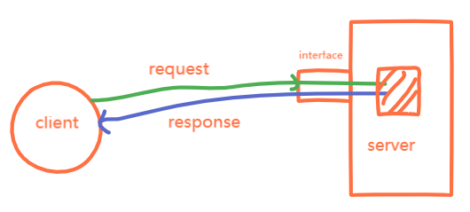
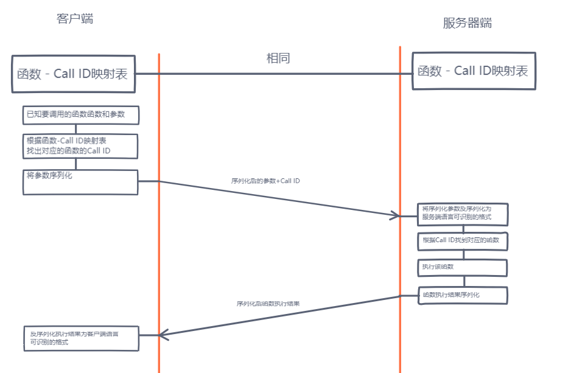

理解RPC（Remote Procedure Call 远程过程调用），让我们先从应用场景来了解。
<escape><!-- more --></escape>

##### 场景一
在软件开发中，很多情况下我们需要调用第三方提供的接口，如钉钉的消息推送接口，微信的获取头像用户名的接口等等。它的调用如下：  
  
1. client根据接口文档，发送格式正确的request的http/https请求  
2. server对外开放的interface接收到这个request
3. server将request的对应的部分作为参数，调用这个对外开放的interface的方法
4. 将这个interface的返回值封装成response的http/https响应返回

##### 场景二
在场景一中，我们作为服务调用者，若我们作为服务提供者呢？我们将从三个方面讨论
###### 内部调用
我们需要调用的这个服务的地方跟这个服务在 *同一模块* 或 *同一服务* 或 *同一应用* 等  
直接import,然后调用对应的函数即可
###### 跨服务调用
这种情况跟场景一基本相同，不同的地方在于我们是第三方的内部员工，可能是一个部门的，也可能不是一个部门的，甚至就是这个服务的开发者  
我们当然可以使用场景一的方式使用http/https请求的方式调用接口来获取服务，但是相对于RPC来说，有很大的缺点，下面将详细说明

#### RESTful(HTTP)和RPC
首先说明，以下比较仅针对内部调用，如果这个服务提供给外部人员使用，选择http更好，因为安全性更有保障。  
内部调用推荐RPC而不是HTTP的原因有以下几点  
* 报文体积小  
RESTful是基于http协议的，而rpc使用的是自定义的tcp协议，报文体积更小。  
* 传输速度快  
正常情况下，对外提供的http接口都是tcp短链接，服务器返回之后链接就断开了，再次使用又需要重新进行tcp三次握手，而rpc则可以使用tcp长链接，减少建立tcp链接的时间。虽然现在http都提供了keepalive参数提供长连接服务，但是大部分对外提供的http接口出于性能要求，都不会使用（保持链接会占用资源）
* 方便维护  
我们从一个示例来看：  
我们有两个接口，A接口提供用户ID和性别姓名，B接口提供用户电话和住址，这四样信息在后台中都是存在一张表中的，但是因为一些原因需要对外暴露成两个接口（这在实际中很常见），这时我们内部服务中同时需要这四样信息，发两个http请求？如果我们还需要在同一张表中的用户姓名呢？新开发一个接口，那么如何维护这个新开发的接口，确保它不会对外暴露呢？  
使用RPC可以很简单的解决这个问题，首先是因为RPC使用的TCP链接是可靠的，其次RPC的Server可以确定自己的调用者Client是已知的且不会被滥用（公司内部项目调用），我们就可以在RPC中的一个服务把所有的信息放上去，由client那边保证敏感信息的安全。
* 和http是一样可以跨平台、跨语言的  

#### RPC 流程
流程如下：   
   
##### 函数-Call ID映射表  
* 映射表客户端和服务器端都需要有  
* 映射表有两张，客户端和服务器端都有。  
* 这张映射表一般是在RCP的TCP长链接建立时产生  
* 客户端与服务器端的映射表内容不需要完全相同,如客户端和服务器端实现的编程语言不同
* Call ID相同的函数功能**一定**要相同
* 客户端Call ID对应的函数是个“*空壳*”引用，实现是由服务器端相同Call ID对应的函数实现

##### 序列化
定义：序列化 (Serialization)是将对象的状态信息转换为可以存储或传输的形式的过程。在序列化期间，对象将其当前状态写入到临时或持久性存储区。以后，可以通过从存储区中读取或反序列化对象的状态，重新创建该对象。[百度百科](https://baike.baidu.com/item/%E5%BA%8F%E5%88%97%E5%8C%96/2890184?fr=aladdin)  
* 序列化和反序列化是RPC实现的重点内容

#### 常见的RPC框架
##### brpc
百度开发的RPC框架，基于google protobuf  
##### Dubbo
Alibaba开发的RPC框架，基于Java Interface和Spring框架
##### gRPC
有基于Netty的Java实现 和 基于net库的Go语言实现
##### Thrift
Fackbook开发，现Apache的项目。支持python等多种语言  

关于RPC框架[点击查看更多](https://www.jianshu.com/p/b0343bfd216e)

