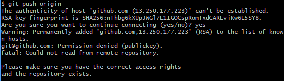

Git是非常主流的提供版本控制系统的软件，相比svn来说，更小更方便使用。
<escape><!-- more --></escape>

## git基本操作指令：
##### 初始化  
未经过初始化的文件夹无法通过git进行版本控制，不同于svn需要另外创建一个repository，初始化后本文件夹既是repository又是master
> git init
##### add代码（提交代码的第一步）
> git add .
##### commit代码（提交代码的第二步）
> git commit -m "描述"

## git基本查看指令：
##### 查看repository和本地add情况
> git status
##### 本地对比repository修改情况（不包含新增项，即便add后也不行）
> git diff .
##### 查看历史提交记录
> git log

## git与github交互：
前提：github存在一个repository
### 场景1： 本地已有一个项目，将该项目托管到github上
##### step1: github新增一个repository，用于该项目托管的地方
##### step2:  初始化
> git init
##### step3: 关联github的repository
> git remote add origin git@github.com:wusevsliuli/EasyJoin.git
##### step4:  add文件
> git add --all
##### step5:  commit文件
> git commit -m "描述"
##### step6:  push代码到远端origin（仅第一次push需要加-u选项）
> git push -u origin
##### step7:  push远端origin代码到master
> git push origin master

## 错误情况处理：
### push错误
##### 1. src refspec master does not match any.

**错误原因**： 目录中没有文件，空目录是不能提交  
**处理方法**：
> git add .
> git commit -m "description"

##### 2. The current branch master has no upstream branch. 

**错误原因**：当前分支主机没有上游分支  
**处理方法**：
> git push --set-upstream origin master

##### 3. Permission denied (publickey). Could not read from remote    repository.

**错误原因**：没有远程推送权限
**处理方法**：
参见 [github上传项目的时候报出git@github.com: Permission denied (publickey). fatal: Could not read from remote repo](https://blog.csdn.net/weixin_44394753/article/details/91410463)

## 告警原因与处理:
### push告警
##### 1. LF will be replaced by CRLF in xxx. The file will have its original line endings in your working directory.  

**告警原因**：跨平台的开发情况

