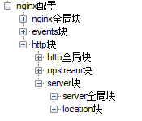
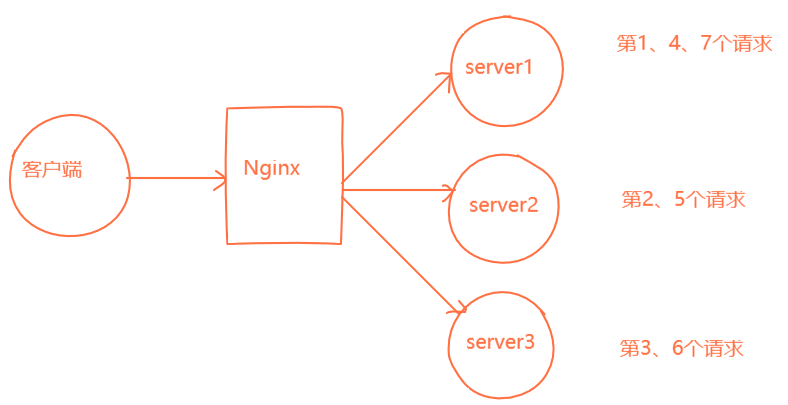
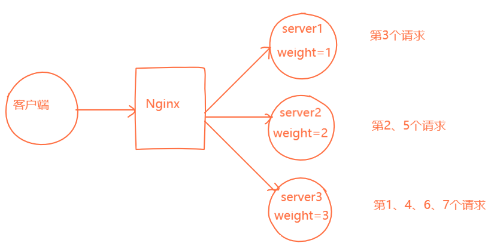

Nginx是一个功能丰富的Web服务器。它支持反向代理服务，内置了负载均衡和Web缓存功能。
<escape><!-- more --></escape>

#### Nginx配置结构
nginx配置如图所示  
  
其中server块和location块可以有多个  
nginx配置中可以通过如下写法定义变量
> set $变量名 变量值 

然后在配置中使用`$变量名`即可替代变量值  
后续配置说明中以 **$** 标记的都将表示变量，以下为使用的变量的含义，不再赘述
* \$path: 表文件/文件夹路径  
* \$num: 表数字  
* \$user: 表用户名
* \$group: 表用户组名
* \$size: 表文件大小
后续配置参数说明中 **|** 符号表示枚举
#### 1. nginx全局块
配置示例  
```bash
user $user $group;
worker_processes $num;
pid $path;
error_log $path $level;
client_max_body_size $size;
client_body_temp $path;
client_body_buffer_size $size;
```
说明如下:
* user  
    Nginx将以此账户来运行  
    \$user表示用户名，默认为nobody  
    \$group表示用户组，默认为nobody 
* worker_processes  
	允许生成的nginx进程数，默认为1，一般不用修改，如果要修改提高性能官方的建议是修改成CPU的内核数，随意设置可能会导致问题，参见[nginx worker_processes 配置](https://www.cnblogs.com/aaron-agu/p/8003831.html)  
* pid  
	nginx在运行时会生成一个记录运行进程pid的文件  
	\$path表示文件路径，文件名一般为nginx.pid  
	\$level表示日志等级，取值有 `debug`|`info`|`notice`|`warn`|`error`|`crit`  
* error_log  
	nginx的产生的服务器日志文件路径，也可以在http块或server块中重设  
	\$path表示文件路径，默认一般为 *nginx安装路径/logs/error.log*  
    **PS**:在子块中重设error_log，字块的nginx操作日志会记录到字块中重设的\$path，同时也会记录到此error_log的\$path中  
    **PS**:一般情况下nginx日志不能被关闭掉，但在linux可以将此日志指定到linux的“黑洞”空间中:
    ```bash
    error_log /dev/null;
    ```
* client_max_body_size  
    允许上传的文件大小，默认为1M  
    **PS**:当这项的值小于上传文件的大小时，nginx会报 *413 Request Entity Too Large* 错误  
* client_body_temp  
    请求临时文件位置  
    \$path为临时文件保存位置，默认为/tmp/  
    **PS**:需要保证$path路径让该nginx的执行账户（`user`字段）有读写权限，否则会出错  
* client_body_buffer_size  
    请求缓存空间大小
    **PS**:当请求数据大于这个值时，将会先储存在`client_body_temp`中  
#### 2. events块
配置示例
```bash
event {
    accept_mutex on|off;
    multi_accept on|off;
    use $model;
    worker_connections $num;
}
```
说明如下  
* accept_mutex    
    使用串行的方式来处理到达的新连接，防止[惊群现象](https://www.jianshu.com/p/1cdd61a6e3ea)发生，默认为on  
    **PS**: 对nginx来说，worker_processes一般会设置成CPU个数，即便发生惊群现象影响也较小（相对于Apache几百个进程来说），主要表现为上下文切换增多或负载上升，如果**网站访问量较大**，为了系统吞吐量可以设为off  
* multi_accept  
    设置一个进程是否同时接受多个网络连接，默认为off  
* use  
    nginx的事件驱动模型  
    \$model取值有 `select`|`poll`|`kqueue`|`epoll`|`resig`|`/dev/poll`|`eventport`  
    **PS**: 一般不更改，nginx会自动选择一个最适合运行nginx操作系统的。  
    **PS**: 如果选择的是kqueue，则将忽略multi_accept的配置
* worker_connections  
    每个worker进程允许同时建立的外部链接的数量，默认为512。  
    **PS**:worker_connections不能随便设置，需要考虑系统内存和操作系统的"进程最大可打开文件数"(linux可通过[*ulimit -n*]命令查看，一般为65535)，worker_commections的值最好不要超过这个数。  
    **PS**:`worker_processes`配置的是有多少个worker，`worker_connections`配置的是每个worker能建立的连接数  
#### 3. http块
##### 3.1 http全局块
配置示例
```bash
http {
    include $type;
    include $path;
    default_type $type;
    log_format $name $format;
    access_log on|off;
    access_log $path $name;
    sendfile on|off;
    sendfile_max_chunk $size;
    keepalive_timeout $num;
    error_page $num $url;
}
```
说明如下  
* include
http请求响应头的Content-Type的值，当映射表找不到时，用此配置，默认为`mime.types`  
* include  
    指定拓展的nginx配置文件（仅在主配置文件中），为简化nginx主配置文件，实现多个站点功能
    \$path表示文件路径，拓展的nginx配置文件，拓展的配置文件为http块子块
* default_type  
    默认返回的文件格式类型，可以在server或locations重新定义，表示服务器返回的数据格式  
    \$type取值有 `application/html`|`application/json`|`application/octet-stream`|`text/plain`等， 默认为`application/octet-stream`  
* log_format  
    自定义日志格式  
    \$name为日志格式名，用于下面`access_log`指定日志格式  
    \$format具体日志格式  
* access_log  
    http访问记录日志  
    on|off 表示关闭http记录访问日志  
    \$path表示日志文件路径  
    \$format为上面`log_format`设置的日志格式，不填即为默认  
    **PS**:`access_log`为http访问记录日志，`error_log`为nginx操作日志  
* sendfile  
    是否允许调用系统的sendfile方法传输文件，默认为off。可以server块或location块中重设  
    **PS**:sendfile方法是直接获取文件句柄后读取文件再通过socket传输到网络中，所以仅当nginx作为静态文件服务器时，开启sendfile能大大提高nginx的性能。当nginx作为反向代理时，无法直接获取文件句柄，此时sendfile是无效的  
* sendfile_max_chunk  
    调用sendfile方法时，每个进程每次调用传输文件大小限制，默认为0，即不设上限  
    \$size为文件大小  
* keepalive_timeout  
    连接超时时间，允许在此时间内客户端通过同一链接再次发送数据，默认为75(秒)，可以在http，server，location块设置。  
    http/https是个无状态协议，同时也是个tcp协议，tcp协议有短链接和长链接之分。短链接情况下，客户端向服务器发送一个请求后，服务器响应完毕就断开tcp链接；长链接情况下，服务响应完毕后并不立即断开tcp链接，允许客户端利用同一链接再次发送请求，减少了重新建立链接的开销  
    **PS**:在此时间内若服务器没有返回将报 *HTTP 408(Request Timed Out)* 错误  
    **PS**:由于在keepalive期间，要一直保持链接，就会一直占用资源，因此不能设置过大  
* error_page  
    接收到某种http响应code，重定向返回的页面  
    error_page有多种使用方法  
    ```bash
    error_page 404 /404.html  # 404状态返回时，跳转至404.html页面  
    error_page 404 500 =200 /index.html  # 404或500状态返回时，跳转至index.html页面并且状态变为200  
    ```
##### 3.2 upstream块
upstream 为nginx的负载均衡配置，也可以理解成nginx的反向代理配置
```bash
http {
    upstream $name {
        ip_hash;
        server $ip:$port;
        server $ip:$port weight=$num;
        server $ip:$port backup;
    }
}
```
说明如下
* $name  
    这个反向代理的名称，可以看做是域名
* ip_hash  
    使用ip hash算法，即对客户端请求的ip进行hash操作，然后根据hash结果将同一个客户端ip的请求分发给同一台服务器进行处理，可以解决session不共享的问题  
* server \$ip:\$port  
    负载均衡的普通轮询方案，示例如图  
      
* server $ip:$port weight=$num  
    负载均衡的加权轮询方案，示例如图  
      
    加权轮询算法详情查看[Nginx加权轮询算法](https://www.cnblogs.com/tenny-peng/p/11532019.html)  
* server $ip:$port backup  
    热备服务器，当所有非backup服务器都宕机或不可用情况下，使用此服务器  
    **PS**:nginx判断服务器宕机或不可用仅识别 *connect refuse* 和 *timeout*  
    **PS**:`backup`不能和`ip_hash`一起使用  
##### 3.3 server块
###### 3.3.1 server全局块
```bash
http {
    server {
        keepalive_requests $num;
        keepalive_timeout $num;
        listen $num;
        server_name $host;
    }
}
```
说明如下  
* keepalive_requests  
    单连接请求上限次数  
* keepalive_timeout  
    同http全局块  
* listen  
    监听端口  
    \$port为监听的端口号  
* server_name  
    监听地址，nginx面向客户端的地址或域名  
    **PS**:配置`server_name`和`listen`后，nginx将监听所有发送到这个IP地址+端口号的所有请求，然后根据下面location块的规则进行转发  
###### 3.3.2 location块
```bash
http {
    server {
        location $reg {
            root $path;
            alias $reg;
            index $filename;
            proxy_pass $host;
            deny $ip;
            allow $ip;
        }
    }
}
```
说明如下  
* $reg  
    请求的url过滤，有如下格式，优先级从上往下  
    ```bash
    location = /uri {}   # 表示精确匹配
    location ^~ /uri {}  # 匹配以uri前缀开头的请求，非正则表达式
    location ~ $reg {}   # 区分大小写的匹配，正则表达式
    location ~* $reg {}  # 不区分大小写的匹配，正在表达式
    location /uri {}     # 表示前缀匹配，非正则表达式
    location / {}        # 通用匹配，默认找不到其他匹配时，会进行通用匹配 
    ```
* root  
    项目的根目录，最终返回的uri是 root路径+location路径  
    **PS**:可以定义在上级块中，若locations没有会依次往上级块中寻找继承  
* alias  
    目录别名，最终返回的uri为 用alias路径替换location中路径部分的uri  
    **PS**:alias需要与location一致，若location末尾带/,则alias必须带  
    **PS**:只能放在location块中  
* index  
    默认页，默认值为index.html
* proxy_pass  
    代理，详见[nginx配置详解（二）]()
* deny   
    拒绝这类ip访问，可以指定ip或网段  
    ```bash
    deny all;  # 拒绝所有的ip
    deny 192.168.1.1;  # 拒绝192.168.1.1访问
    deny 192.168.0.0/24;  # 拒绝192.168.0.0 255.255.0.0 网段访问
    ```
* allow  
    允许的ip，填写格式与deny相同  

