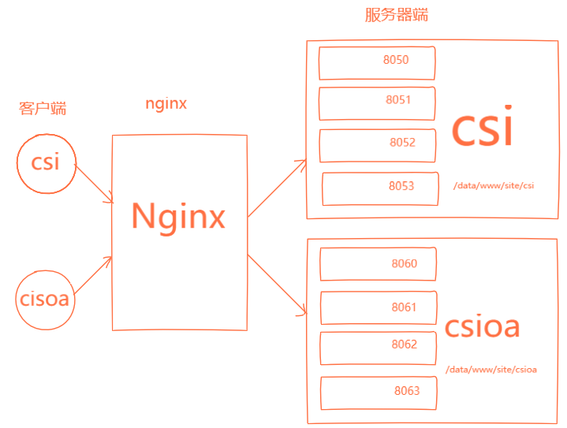
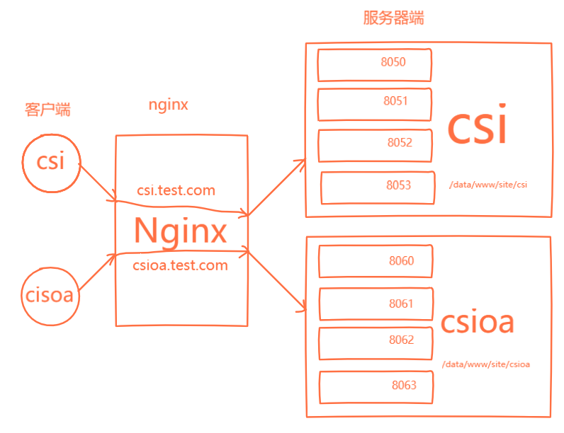

这篇笔记将详细说明nginx的负载均衡和反向代理的配置，以及https服务器和email服务器的配置，以及一些特殊参数
<escape><!-- more --></escape>


### 负载均衡
在[nginx配置详解（一）]()中upstream块中已经介绍了nginx内置的两种负载均衡模式：  
* 轮询模式  
* 加权轮询模式  

### 反向代理
配置nginx首先需要理解以下内容：
1. 一台服务器主机上一般只会起一个nginx服务。*在一台服务器主机上起多个nginx服务* 跟 *在一个nginx服务配置多个server块* 没什么区别，反而会影响服务器性能。  
2. 一个nginx可以通过配置server块监听多个ip和多个端口
3. nginx主配置文件是该服务器主机对外的**唯一**出口，出口可以有多个
4. upsteam是用于配置负载均衡的，负载均衡的定义是将多个同服务的请求分摊到多个提供相同功能的服务器上。由于nginx可以配置多个server，所以 多个server块 + 多个upstream块 即可实现反向代理功能

#### 示例一
一台服务器上部署了两个项目**cis**和**cisoa**，现使用nginx做反向代理，客户端访问同一域名可以跳转到不同服务。 如图所示
  
nginx和两个服务器端在一台主机上   
项目域名为 `csi.test.com`  
**csi**项目访问url为: *http://csi.test.com/csi/*  
**csioa**项目访问url为: *http://csi.test.com/csioa/*  
**csi**项目服务器端启用端口为 8050~8053
**csioa**项目服务器端启用端口为 8060~6063
**csi**项目根目录在 */data/www/site/csi/*  
**csioa**项目根目录在 */data/www/site/csioa/*  

**PS** 理解一下HTTP服务器和应用（Application）服务器的区别  
应用服务器一般是开发语言提供的实现，如python的django，tornado

###### csi配置
```bash
# conf/csi.conf
upstream csi {
    server csi.test.com:8050;
    server csi.test.com:8051;
    server csi.test.com:8052;
    server csi.test.com:8053;
}
```
###### csioa配置
```bash
# conf/csioa.conf
upstream csioa {
    server csi.test.com:8060;
    server csi.test.com:8061;
    server csi.test.com:8062;
    server csi.test.com:8063;
}
```
###### nginx主配置
```bash
# nginx.conf
...
events {
    ...
}
http {
    ...
    include conf/*.conf;

    server {
        listen 80;
        server_name csi.test.com;
        root /data/www/site;

        location ^~ /csi {
            proxy_pass http://csi;
            ...
        }

        location ^~ /csioa {
            proxy_pass http://csioa;
            ...
        }

    }
}
```
**PS** csi和csioa本质上还是一个项目，只是一个项目的两个模块（子项目）放在了不同的Application服务器上。所有csi和csioa的uri的前缀分别需要为/csi/和/csioa/


#### 示例二
现新增了一个域名 `csioa.test.com` ，在服务器上要将两个项目的域名分离，其他不变，如图所示
  


###### csi配置
```bash
# conf/csi.conf
upstream csi {
    server csi.test.com:8050;
    server csi.test.com:8051;
    server csi.test.com:8052;
    server csi.test.com:8053;
}
server {
    listen 80;
    server_name csi.test.com;
    location / {
        root /data/www/site/csi;
        proxy_pass http://csi;
        ...
    }
}

```
###### csioa配置
```bash
# conf/csioa.conf
upstream csioa {
    server csi.test.com:8060;
    server csi.test.com:8061;
    server csi.test.com:8062;
    server csi.test.com:8063;
}
server {
    listen 80;
    server_name csioa.test.com;
    location / {
        root /data/www/site/csioa;
        proxy_pass http://csioa;
        ...
    }
}
```
###### nginx主配置
```bash
# nginx.conf
...
events {
    ...
}
http {
    ...
    include conf/*.conf;
    ...
}
```  


### 负载均衡的python实现（伪代码）
#### 轮询模式
```python
import WebServer  # 服务器端的实现
import Request  # 客户端发送过来的请求结构
from collections import namedtuple

server_list = [server1, server2, server3]
cur_idx = 0

def forward2server(server: WebServer, request: Request):
    # 将请求转发给实际服务器
    ...

while request:
    cur_idx = cur_idx % len(server_list)
    forward2server(server_list[cur_idx], request)
    cur_idx += 1

```
#### 加权轮询模式
```python
import WebServer  # 服务器端的实现
import Request  # 客户端发送过来的请求结构
from collections import namedtuple

WeightServer = namedtuple('WeightServer', ['server', 'weight'])

w_server_list = [
    WeightServer(server1, w1),
    WeightServer(server2, w2),
    WeightServer(server3, w3),
]
cur_weight_list = [0, 0, 0]
sum_value = sum(ws.weight for ws in w_server_list)

def forward2server(server: WebServer, request: Request):
    # 将请求转发给实际服务器
    ...

while request:
    for i, ws in enumerate(w_server_list):
        # 加权
        cur_weight_list[i] += ws.weight
    # 选择权重最大的服务器，来转发
    max_weight = max(cur_weight_list)
    max_idx = cur_weight_list.index(max_weight)
    forward2server(w_server_list[max_idx].server, request)
    # 降低刚才发送的服务器的权重，减去权重总和
    cur_weight_list[max_idx] -= sum_value
```
