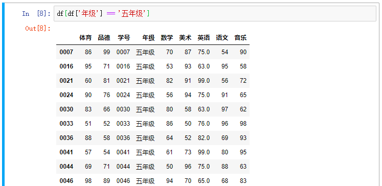
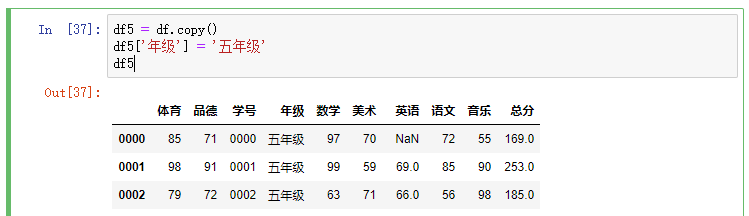
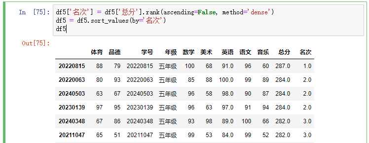

Pandas是Python用于数据分析的最流行的库，以下以**小学考试成绩**为示例，展示Pandas的使用
<escape><!-- more --></escape>
快速系统的学习和了解pandas 推荐阅读 [10 minutes to pandas](https://pandas.pydata.org/pandas-docs/stable/getting_started/10min.html)。

### 生成数据
这里随机生成1000+条数据，我们以学号作为DataFrame的Index
```python
import random
import pandas

def get_random_data():
    data = []
    for i in range(random.randint(1000, 1200)):
        grade_list =  ['一年级', '二年级', '三年级', '四年级', '五年级', '六年级']
        grade = random.choice(grade_list)
        data.append({
            '学号': "{:0>4}{:0>4}".format(2019 - grade_list.index(grade), i),
            '年级': grade,
            '语文': random.randint(50, 100),
            '数学': random.randint(50, 100),
            '英语': None if grade in ['一年级', '二年级'] else random.randint(50, 100),
            '品德': random.randint(50, 100),
            '体育': random.randint(50, 100),
            '美术': random.randint(50, 100),
            '音乐': random.randint(50, 100),
        })
    return data
    
data = get_random_data()
df = pandas.DataFrame(data, index=[stu['学号'] for stu in data])
```
### 示例场景
#### 计算各个年级各学科的平均分
> df.groupby('年级').mean()


#### 仅显示主学科(语文、数学、英语)的平均分
> df.groupby('年级').mean()[['语文', '数学', '英语']]


#### 显示五年级的所有学生的成绩
> df[df['年级'] == '五年级']


如果需要将各个年级分离，即产生6张表，每张表对应一个年级
> df5['年级'] = '五年级'



#### 显示五年级中所有英语不及格（低于60分）的学生
> df5[df5['英语'] < 60]


#### 新增总分列为主科（语文、数学、英语）的总分
> df['总分'] = df.apply(lambda row: row[['语文', '数学', '英语']].sum(skipna=True), axis=1)


或
> df['总分'] = df[['语文', '数学', '英语']].sum(skipna=True, axis=1, min_count=1)


#### 按总分从高到低排序，若总分相同依次按数学/英语/语文来排序
> df5.sort_values(by=['总分', '数学', '英语', '语文'], ascending=False)


#### 按总分从高到低排名并添加排序，总分相同名次相同
> df5['名次'] = df5['总分'].rank(ascending=False, method='dense')
> df5.sort_values(by='名次')



#### 取出五年级年级前十（仅按顺序取十位）
> df5.head(10)


或
> df5[:10]


