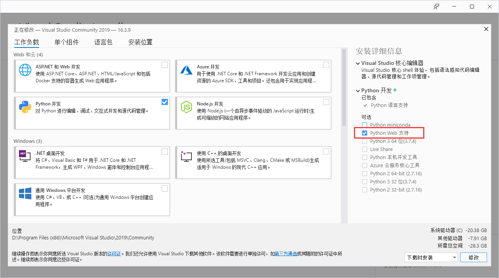
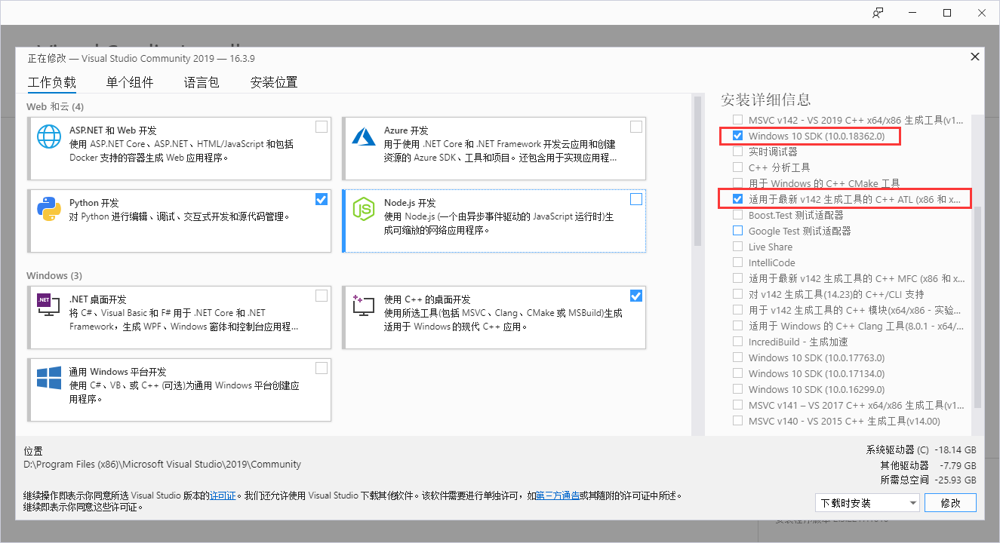
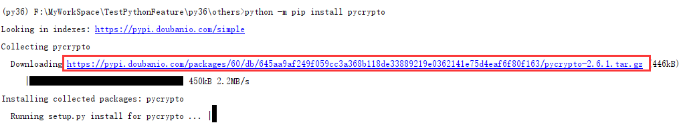

pycrypto是个加密库，在windows上安装有很多坑。之前都是使用的别人集成好的exe进行安装的，但是目前项目用的是Python3.6，没有找到对应版本的集成包，只好手动安装了，步骤如下
<escape><!-- more --></escape>

### 下载 Visual Studio 2019  
别问为啥是这个版本，不是2015，现在在微软官网上只能下到这个了  
[传送门](https://visualstudio.microsoft.com/zh-hans/vs/)
下载社区版（Community）就行了，然后安装  

几个重要的（必选）
1. Python Web支持  
  
2. Win10 SDK（选最新的那个就行了） 和 V142生成工具  
  
其他的不放心可以把windows相关的都点了 (￣▽￣)ノ  

下载完了并不算完，进入目录，大概是这个位置 ***C:\Program Files (x86)\Microsoft Visual Studio 14.0\VC*** 下面会有一个 **vcvarsall.bat** 文件，使用命令行运行(这个才是正宗的依赖库安装，不允行这个pycrypto在windows下永远缺依赖)  
> vcvarsall.bat x64  

如果出现什么 **VS Common Tools** 的Error，检查你的环境变量，查看 **C:\Windows\System32** 在不在系统变量的Path里面，没有就加进去再运行  

### 下载 Windows Kits  
先看下这个路径存不存在 ***C:\Program Files (x86)\Windows Kits*** 不存在再下载安装，否则就不用了  
[传送门](https://download.microsoft.com/download/4/2/2/42245968-6A79-4DA7-A5FB-08C0AD0AE661/windowssdk/winsdksetup.exe)(这个链接点了就会直接下载，注意哦)  

### 下载 pycrypto 的包  
你也可以直接使用 pip install pycrypto。我是因为在踩这个坑，使用pip的话每次都要下载，比较浪费时间，所有下载包使用 python setup.py install 来安装了  
传送门就不给了，使用pip install pycrypto的时候，命令行上会显示这个路径，如下
  
我用的是豆瓣源  

### 设置环境变量  
这些准备就绪后，使用`python setup.py install` 或`python -m pip install pycrypto` 安装如果出问题，80%都是环境变量的问题，还有20%情况就把Visual Studio 上关于Windows的东西全勾了吧  

下面说下环境变量的问题  
pycrypto 安装的时候会寻找依赖的 **.lib** 和 **.h** 文件，而这些是由环节变量里面的 **LIB** 和 **INCLUDE** 索引到的，所有要把相关的路径都加上，如下  
* **LIB**   
    C:\Program Files (x86)\Windows Kits\10\Lib\10.0.18362.0\ucrt\x64;  
    C:\Program Files (x86)\Microsoft Visual Studio 14.0\VC\lib;  
* **INCLUDE**  
    C:\Program Files (x86)\Microsoft Visual Studio 14.0\VC\include;  
    C:\Program Files (x86)\Windows Kits\10\Include\10.0.18362.0\ucrt\;  
    C:\Program Files (x86)\Windows Kits\10\Include\10.0.18362.0\shared;  
    C:\Program Files (x86)\Windows Kits\10\Include\10.0.18362.0\um;  

除了LIB和INCLUDE，**Path** 上需要 Visual Studio 的 bin路径，因为安装过程中使用到了 cl.exe  
* **Path**  
    C:\Program Files (x86)\Microsoft Visual Studio 14.0\VC\bin;  
    C:\Windows\System32;  
    
除此之外，如果你的Python版本低于3.6，可能还需要加些别的环节变量，安装完 Visual Studio 2019 后，一般会自动创建一个环境变量  
* **VS140COMNTOOLS**  
    C:\Program Files (x86)\Microsoft Visual Studio 14.0\Common7\Tools\;  

然后加上  
* **VS100COMNTOOLS**  
    %VS140COMNTOOLS%  

至此环境变量已经全部设置完毕了，你以为完了吗，如果你这个时候执行 `python setup.py install`  或者 `python -m pip install pycrypto` 多半会告诉你什么 **语法错误**，那是因为 pycrypto 引用的 stdint.h 不对，所以在执行安装执行需要先执行如下命令  
> set CL=-FI"C:\Program Files (x86)\Microsoft Visual Studio 14.0\VC\include\stdint.h"  

这是由于pycrypto使用的stdint.h有区别导致的  

当然你也可以吧CL设置成环境变量 (￣▽￣)ノ
* **CL**  
    -FI"C:\Program Files (x86)\Microsoft Visual Studio 14.0\VC\include\stdint.h"

