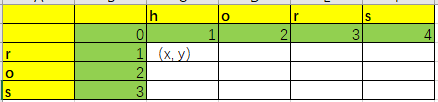
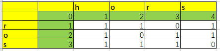

# 最短编辑距离算法

### 前言
在最近碰到项目时需要对文本内容进行分类。一开始是使用机器学习的nltk库来分类，然后发现并不符合预期，因为文本内容是套用模板生成的，不同之处只有部分变量内容。而nltk库是通过文本整体概率来分类的，因此不符合预期情况。
以下为最短编辑距离算法的**题目**与**解法**与**python代码**

### 题目
给定两个单词 word1 和 word2，计算出将 word1 转换成 word2 所使用的最少操作数 。
你可以对一个单词进行如下三种操作：
1. 插入一个字符
2. 删除一个字符
3. 替换一个字符

示例 1:
> 输入: word1 = "horse", word2 = "ros"
输出: 3
解释:
horse -> rorse (将 'h' 替换为 'r')
rorse -> rose (删除 'r')
rose -> ros (删除 'e')

示例 2:
>输入: word1 = "intention", word2 = "execution"
输出: 5
解释:
intention -> inention (删除 't')
inention -> enention (将 'i' 替换为 'e')
enention -> exention (将 'n' 替换为 'x')
exention -> exection (将 'n' 替换为 'c')
exection -> execution (插入 'u')

来源：[力扣（LeetCode）](https://leetcode-cn.com/problems/edit-distance)

### 解题
**初始化table1**：初始填充

**初始化table2**：对比字符串生成

```txt
(x, y) 处的值为 min {
    table1[x-1,y], 
    table1[x, y-1],
    table1[x-1, y-1] + table2[x, y]
}
```
**需要逐步计算，table[len(str1), len(str2)] 即为最短编辑次数**

### 代码Python
```python
import numpy

def get_similarity(txt1, txt2):       
    """    
    获取txt1和txt2的相似度 
    
    :param txt1:  
    :param txt2:  
    :return:    
    """
    length1, length2 = len(txt1), len(txt2)   
    matrix = numpy.zeros((length2 + 1, length1 + 1))  # 创建矩阵 
    # 初始化矩阵    
    for col_idx in range(length1):    
        matrix[0][col_idx] = col_idx    
        for row_idx in range(length2):      
            matrix[row_idx][0] = row_idx    
    # 开始进行动态规划    
    for row_idx in range(1, length2 + 1):    
        for col_idx in range(1, length1 + 1):     
            cost = 0 if txt1[col_idx - 1] == txt2[row_idx - 1] else 1  # 代价值     
            # 三种字符串操作方式增加 删除 替换      
            edit_exchange_dis = matrix[row_idx - 1][col_idx - 1] + cost  # 替换        
            edit_add_dis = matrix[row_idx - 1][col_idx] + 1  # 添加    
            edit_del_dis = matrix[row_idx][col_idx - 1] + 1  # 删除      
            matrix[row_idx][col_idx] = min(edit_exchange_dis, edit_add_dis, edit_del_dis)  # 选取最小的代价  
    # return matrix[length2][length1]  # 返回最短编辑距离
    similarity = 1 - matrix[length2][length1] / max(length1, length2) 
    print("相似度", similarity)   
    return similarity


```


