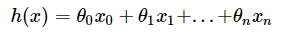
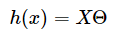
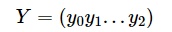
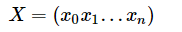
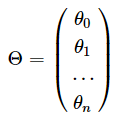
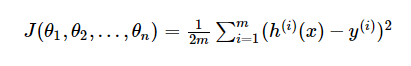
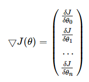
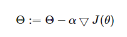
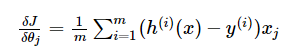
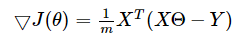

最近在学习机器学习的相关知识，碰到的第一个机器学习算法便是这个梯度下降算法，以下为个人对此算法的理解，以及算法的实现
<escape><!-- more --></escape>

### 算法描述
设多元回归方程为

需要注意的是 h(x) 中的 x 表示的是 x0 ~ xn，是多个参数。其中x0 = 1
该方程等价于矩阵乘法

其中 



该多元回归的代价函数（均方差代价函数）为：

其中m为样本个数，n为维度，i表示第几个样本
其梯度矩阵为

根据梯度下降的算法，表达式为

直到 $\Theta$ 足够小（收敛）
将梯度项函数表达式为

则可以将梯度矩阵转化为为



### 实现代码
```python
import numpy

# 样本
SAMPLE = [
    (1, 3),
    (2, 4),
    (3, 5),
    (4, 5),
    (5, 2),
    (6, 4),
    (7, 7),
    (8, 8),
    (9, 11),
    (10, 8),
    (11, 12),
    (12, 11),
    (13, 13),
    (14, 13),
    (15, 16),
    (16, 17),
    (17, 18),
    (18, 17),
    (19, 19),
    (20, 21)
]

m = len(SAMPLE)  # 样本个数
n = 2  # x 元素个数
limit = 1e-5  # 收敛值

X0 = numpy.ones((m, 1))  # x0的矩阵
X1 = numpy.array([itm[0] for itm in SAMPLE]).reshape(m, 1)  # x1的矩阵
# Xn = numpy.array([itm[n] for itm in SAMPLE]).reshape(m, 1)  # Xn的矩阵
X = numpy.hstack((X0, X1))
# X = numpy.hstack((X0, X1, ..., Xn))

Y = numpy.array([itm[-1] for itm in SAMPLE]).reshape(m, 1)  # y的矩阵

alpha = 0.01  # 学习率

THETA = numpy.array([2, 2]).reshape(2, 1)  # 起始选择的 theta0, theta1的值
# THETA = numpy.array([2, 2, ..., 2]).reshape(n, 1)  # 起始选择的 theta0, theta1, thetan的值


def error_function(theta, X, Y):
    """
    代价函数

    :param theta:
    :param X:
    :param Y:
    :return:
    """
    diff = numpy.dot(X, theta) - Y  #
    return 1.0 / (2 * m) * numpy.dot(diff.T, diff)


def gradient_function(theta, X, Y):
    """
    梯度下降

    :param theta:
    :param X:
    :param Y:
    :return:
    """
    diff = numpy.dot(X, theta) - Y
    return 1.0 / m * numpy.dot(X.T, diff)


def gradient_descent():
    theta = THETA
    gradient = gradient_function(theta, X, Y)
    while not numpy.all(numpy.absolute(gradient) <= limit):
        theta = theta - alpha * gradient
        gradient = gradient_function(theta, X, Y)
    return theta


if __name__ == '__main__':
    theta = gradient_descent()
    J_theta = error_function(theta, X, Y)
    print(theta)
    print(J_theta)
```